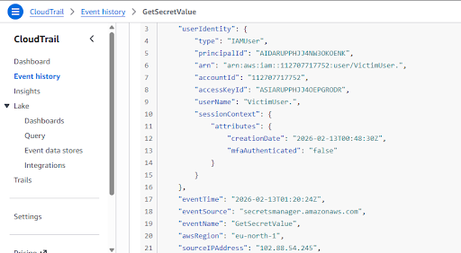
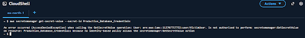

# ☁️ AWS Cloud Security Lab: Automated Threat Detection & Privilege Revocation
**Project by: @techyteeana** | **AltSchool Africa Cybersecurity**

## 📌 Project Overview
For this cloud security project, I built an automated detection and response system inside AWS to stop credential leaks. I simulated an "insider threat" scenario where an unauthorized user account (`VictimUser.`) tried to break into AWS Secrets Manager to steal production database credentials. 

Instead of waiting around for a human analyst to see an email and fix it, I set up an automation pipeline that intercepts the attack and completely strips the intruder's admin privileges in under 60 seconds.

---

## 🛠️ What I Used
* **AWS CloudTrail:** To log every single API action across the environment.
* **Amazon EventBridge & Lambda:** The automation team. EventBridge catches the specific alert, and Lambda runs a Python script to act as a "Kill-Switch."
* **CloudWatch & SNS:** The backup team. It tracks the metrics and sends out email alerts to human admins.
* **IAM & Secrets Manager:** The targets being defended.

---

## 🏗️ How the Detection Flow Works
I set up two different paths to handle the breach when an unauthorized account calls the `GetSecretValue` command:

1. **The Automated Path (Fast):** Amazon EventBridge spots the unauthorized access attempt instantly and fires off my Python Lambda function. The Lambda function runs `iam:DetachUserPolicy` to instantly kick the user out. This whole process takes less than a minute.
2. **The Human Path (Slower Backup):** A CloudWatch Metric Filter scans the CloudTrail logs, triggers an alarm, and passes it to Amazon SNS, which sends a notification email to my inbox. 

---

## 🔍 The "Full Stop" Bug (My Biggest Headache)
I ran into a massive roadblock during testing where the automation would trigger, but the intruder still had full admin control. It felt completely broken.

### What went wrong:
I went digging into the raw **CloudTrail Event History Logs** to figure out why the Lambda script was failing. I realized that when the test user account was created, it was named **`VictimUser.`** with a literal period/full stop at the very end of the username. 

My Python script was looking for an exact match for `"VictimUser"` (without the period). Because of that tiny character mismatch, the script couldn't find the user profile to strip its permissions.

### How I fixed it:
I modified the Lambda code to properly parse the string and include that trailing character. I also double-checked the Lambda execution role to ensure it had exact permissions to detach policies. Once I updated the code and re-ran my exploit script, the kill-switch worked perfectly.

---

## 🧪 Testing Results & Proof

### 1. The Real-Time Race (Metrics)
The log data proved exactly why security automation is necessary. Looking at my timestamps:
* **Attack Started:** `01:20:24Z`
* **Automated Kill-Switch Executed:** In under 60 seconds.
* **Human Email Alert Arrived:** `01:23:10Z` (Almost 3 minutes later!)

By the time the human analyst even opened the email notification, the automated script had already stopped the attack.

*Above: CloudTrail log metadata capturing the unauthorized attempt to read the database credentials.*

### 2. The Attacker's View
To confirm it worked, I tried to run follow-up commands as the attacker immediately after the secret was touched. The AWS console threw a massive red `AccessDeniedException` warning because the script had already stripped my rights.

*Above: Verification screenshot showing the attacker blocked by an access denial immediately after triggering the alarm.*

---

## 🚀 Lessons Learned
* **Precision matters:** Cloud automation requires perfect string matching. One accidental period can completely bypass a security script.
* **Closing the Gap:** Relying on human alerts leaves a dangerous 2-to-3 minute gap where an attacker can steal data or pivot. Automation drops that window down to seconds.
* **IAM Baselines:** I also verified that forcing a password reset on a user's first login is an absolute must to prevent credential stuffing from leaked accounts.
