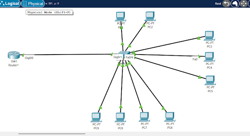
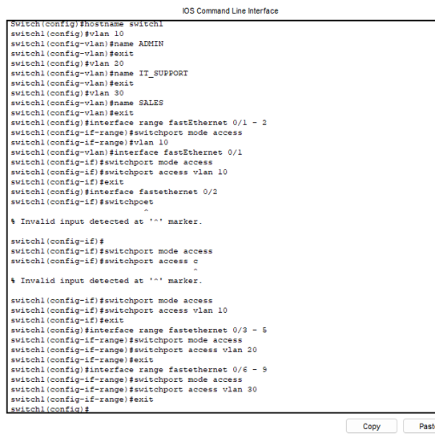
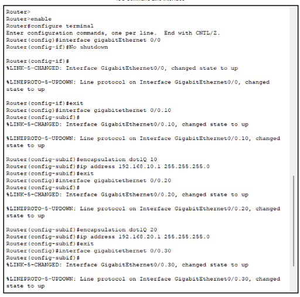
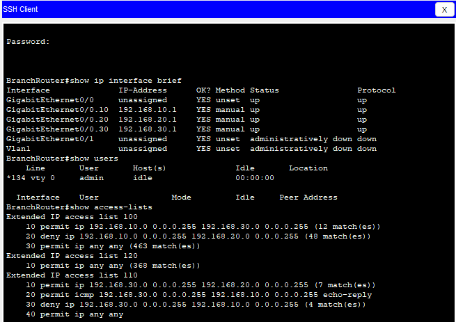
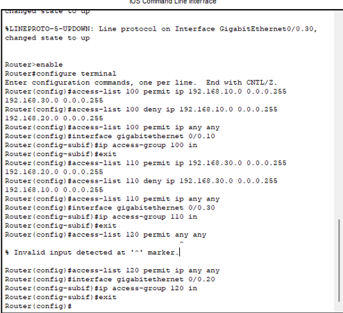

# 🌐 Networking Simulation: Secure Branch Office Setup
**Project by: @techyteeana** | **AltSchool Africa Cybersecurity**

## 📌 The Project Goal
This project was part of my first-semester technical evaluation. The objective was to design a secure network for a mid-sized financial company by moving away from a "flat" network and building a segmented environment where departments are isolated.

## 🛠️ How I Built It
I used a **Star Topology** with 9 PCs connected to a central switch, which then linked to a router for **Inter-VLAN routing**.

### 1. Network Segmentation (VLANs)
I didn't want the Sales team to have access to sensitive Admin files, so I broke the network into three virtual pieces:
*   **VLAN 10 (Admin):** Port-assigned for management.
*   **VLAN 20 (IT Support):** My technical "power users".
*   **VLAN 30 (Sales):** The general staff area.

   

### 2. The "Router-on-a-Stick" Method
To get these separate VLANs to talk to each other securely, I configured **Trunk Ports**. This allows multiple VLANs to share one physical cable to the router, where I set up sub-interfaces for each department to act as their gateway.

### 3. Secure Management (SSH over Telnet)
A big part of this lab was securing the router itself. I disabled Telnet (because it sends passwords in plain text) and set up **SSH with 1024-bit RSA encryption** I hit a small snag with an "invalid input" error during key generation, but I learned that the CLI requires a specific order: `crypto key generate rsa`, then specifying the modulus.

---

## 🛡️ The "AHA!" Moment: Access Control Lists (ACLs)
The ACLs were the most challenging part of the entire exam. My goal was to enforce **The Principle of Least Privilege** giving users only the access they need.

**My Logic:**
*   **Admin:** Can access Sales, but is blocked from IT.
*   **Sales:** Can access IT, but is blocked from Admin.
*   **IT Support:** Has the "keys to the kingdom" and can access everyone.

**The Struggle:**
When I first tested the Admin-to-Sales connection, the **ping failed**. I realized that while the Admin's "Ask" (Echo Request) was getting through, the Sales "Answer" (Echo Reply) was being killed by the router's ACL. 

**The Fix:** I added a specific rule to **ACL 110** to permit ICMP echo-replies. This was a huge lesson for me: in security, you have to think about the traffic coming *back*, not just the traffic going *out*.

---

## 🚀 Final Reflection
This project taught me that "Functional" and "Secure" are two different things. A network can "work" and still be a disaster if an attacker can jump from a Sales PC straight into the Admin database. Precision in your commands and your documentation is what makes the difference between a student and a professional.
