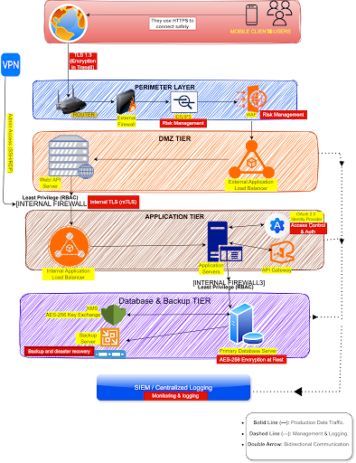

# 🏦 Secure 3-Tier Banking Architecture: PayLink Africa
**Project by: @techyteeana** | **AltSchool Africa Cybersecurity**

## 📌 Project Overview
This project involved designing a secure, high-availability **3-Tier Network Architecture** for a fintech platform named PayLink Africa. My main goal was to design a blueprint aligned with the **NIST SP 800-53** framework that completely isolates sensitive database records from the public internet using a strict Defense-In-Depth model.

---

## 🏗️ The 3-Tier Security Framework
I structured the infrastructure into three strictly isolated network boundaries to prevent lateral movement and reduce the blast radius if a breach occurs:

* **Tier 1: Web Tier (The Public Front):** Houses the public-facing web servers. This layer is guarded at the network perimeter by a Web Application Firewall (WAF) and an Intrusion Detection/Prevention System (IDPS) to intercept and neutralize SQL Injection (SQLi) and malicious web traffic before it touches internal compute resources.
* **Tier 2: Application Tier (The Logic Hub):** Contains the core business processing logic. I positioned an API Gateway here to handle and validate banking transaction requests, routing identity checks directly to a dedicated OAuth verification service. 
* **Tier 3: Database Tier (The Vault):** Holds sensitive transaction ledgers and customer records. This layer is completely cut off from direct internet access. I implemented **AES-256 encryption** and an independent Key Management Service (KMS) to ensure complete cryptographic isolation for data at rest.

*Above: Complete architectural blueprint detailing network segmentation, asset placement, and security perimeters.*

---

## 🔍 Engineering Challenge: Decoupling Complex Network Routing
The most challenging part of this design was mapping out the internal routing pathways and access control rules within **Tier 2 (Application Tier)**.

### The Problem
During the initial draft, mapping out the connections between the Web Servers, the core Application Server, external banking APIs, and the internal OAuth identity service quickly became overcrowded with overlapping bidirectional paths. Allowing the web tier to communicate directly with all components simultaneously would have broken network segmentation rules and exposed too much attack surface.

### The Solution
I stripped out the overlapping pathways and redesigned Tier 2 using a strict **Hub-and-Spoke model**. I designated the central Application Server as the explicit hub, meaning it is the only component authorized to act as a middleman for data flow. 
* Web servers can only initiate communication with the App Server.
* The App Server safely handles backend queries to the database and validation checks to the OAuth service independently.

This clean separation ensures that if an attacker compromises a frontend web server, they are permanently trapped within the DMZ network boundary and cannot pivot deeper into the environment.

---

## ⚙️ Security Engineering Controls
* **Data-In-Transit Protection:** Enforced **TLS 1.3** across all internal and external network connections (Client to Web, and Web to App to DB) to guarantee end-to-end encryption.
* **Zero Management Footprint:** Eliminated all public-facing administrative entry points (like open SSH/RDP ports). System management is strictly restricted to authorized administrators logging in through an encrypted **Management VPN**.
* **Secure Monitoring Path:** Configured log forwarding to the centralized **SIEM** via unidirectional (one-way) data collection pathways, ensuring monitoring links cannot be reverse-exploited to pivot back into production environments.

---

## 🚀 Cloud Migration Strategy (AWS Alternative)
If shifting this on-premise infrastructure layout to an entirely cloud-native AWS environment, I would swap out the physical hardware boundaries for software-defined infrastructure:
* **Physical Firewalls ➡️ Security Groups & Network ACLs (NACLs):** Implementing stateful firewalling rules directly at the instance level and stateless filters at the subnet boundaries.
* **Standalone Backup Server ➡️ Multi-AZ Amazon RDS:** Moving from a localized backup server to a managed database instance using automated snapshots and multi-Availability Zone deployment for automated failover.
* **Network Boundaries ➡️ Identity-Based Control:** Transitioning focus from physical hardware segments to granular **IAM (Identity and Access Management)** resource policies and secure VPC Peering.
